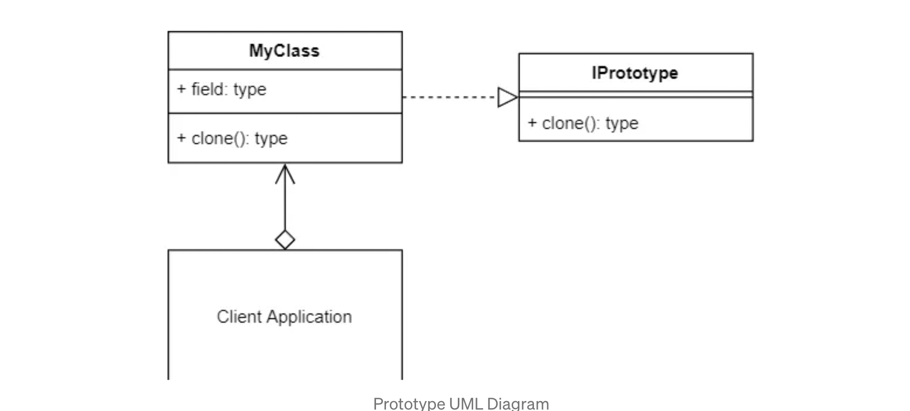

## Prototype
`Prototype` is a creational design pattern that lets you copy existing objects without making your code dependent on their classes.

### 🙁 Problem:
- Say you have an object, and you want to create an exact copy of it. How would you do it? First, you have to create a new object of the same class. Then you have to go through all the fields of the original object and copy their values over to the new object.
- Nice! But there’s a catch. Not all objects can be copied that way because some of the object’s fields may be private and not visible from outside of the object itself.

- eg: we have notes book, lets create a 1000 notebooks of 120 pages, A4 size, rules 
```
class Notebook {
    - height
    - width
    - numPages
    - type -> ruled or blank
    - funfacts -> list of strings
    - coverDesign -> a png or jpeg image
}
```

### 😆 Solution:
- In the Prototype patterns interface, you create a `clone()` method that should be implemented by all classes that use the interface. How the clone method is implemented in the concrete class is up to you. You will need to decide whether a shallow or deep copy is required.
    - A shallow copy, copies and creates new references one level deep
        -  will create new copies of the objects with new references in memory, but the underlying data, e.g., the actual elements in an array, will point to the same memory location as the original array/object being copied. You will now have two arrays, but the elements within the arrays will point to the same memory location. So, changing any elements of a copied array will also affect the original array.
    - A deep copy, copies and creates new references for all levels.

### 𝌘 Terminology:
- `Prototype Interface`: The interface that describes the clone() method.
- `Prototype`: The Object/Product that implements the Prototype interface.
- `Client`: The client application that uses and creates the Prototype.

### 🎨 UML Diagram:


### 🔖 How to Implement ?
1. Create the prototype interface and declare the clone method in it. Or just add the method to all classes of an existing class hierarchy, if you have one.
2. A prototype class must define the alternative constructor that accepts an object of that class as an argument. The constructor must copy the values of all fields defined in the class from the passed object into the newly created instance. If you’re changing a subclass, you must call the parent constructor to let the superclass handle the cloning of its private fields.
3. The cloning method usually consists of just one line: running a new operator with the prototypical version of the constructor. Note, that every class must explicitly override the cloning method and use its own class name along with the new operator. Otherwise, the cloning method may produce an object of a parent class.

### 💡 Applicability - When is prototype required ?
- The Prototype design pattern is good for when creating new objects requires more resources than you want to use or have available. You can save resources by just creating a copy of any existing object that is already in memory.
- E.g., A file you’ve downloaded from a server may be large, but since it is already in memory, you could just clone it, and work on the new copy independently of the original.
- Use the Prototype pattern when your code shouldn’t depend on the concrete classes of objects that you need to copy.

### code:
- In my example, I have created an array of numbers. At first impressions, when this array is copied, it will appear that the array was fully cloned. But the inner items of the array were not. They will point to the same memory location as the original array; however, the memory identifier of the new array is new and different from the original.
- In the MyClass.clone() method, there is a line return JSON.parse(JSON.stringify(this)); that is commented out. Uncomment out this line, and comment out the line before it to now be  // return Object.assign({}, this).
- Re compile and execute the file, and now the array items will be copied as well. This is a `deep copy`.

### Real world example:
- List of other examples:
    - Mobile Phone making company releasing different mobiles for various segments. Now, each mobile will have some basic common functionality with some extent of variations. Here, the company will use one of its phone software and clone it according to other phones.
- Laptop making company designs Laptop’s body for one laptop in the software. After that, for future releases of this Laptop model, the company will simply clone the last model’s body and do the required changes as per the latest trend and requirements.