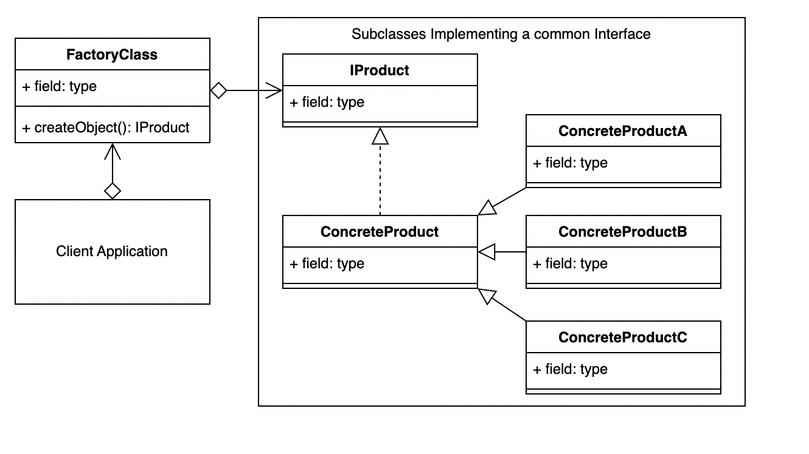
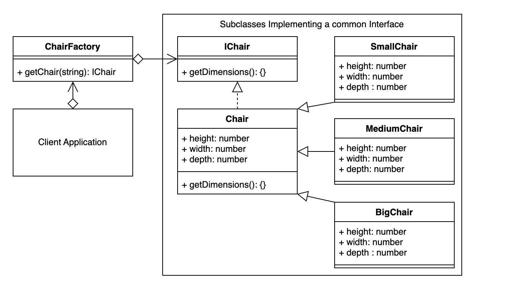

## Factory 
`Factory Method` is a creational design pattern that provides an interface for creating objects in a superclass, but allows subclasses to alter the type of objects that will be created.

### 🙁 Problem:
- Imagine that you’re creating a logistics management application. The first version of your app can only handle transportation by trucks, so the bulk of your code lives inside the `Truck` class.
- After a while, your app becomes pretty popular. Each day you receive dozens of requests from `sea` transportation companies to incorporate sea logistics into the app.
- Great news, right? But how about the code? At present, most of your code is coupled to the Truck class. Adding Ships into the app would require making changes to the entire codebase. Moreover, if later you decide to add another type of transportation to the app, you will probably need to make all of these changes again.
- As a result, you will end up with pretty nasty code, riddled with conditionals that switch the app’s behavior depending on the class of transportation objects.

### 😆 Solution:
- The Factory Method pattern suggests that you replace direct object construction calls (using the new operator) with calls to a special factory method. Don’t worry: the objects are still created via the new operator, but it’s being called from within the factory method. Objects returned by a factory method are often referred to as products.
- At first glance, this change may look pointless: we just moved the constructor call from one part of the program to another. However, consider this: now you can override the factory method in a subclass and change the class of products being created by the method
- There’s a slight limitation though: subclasses may return different types of products only if these products have a common base class or interface. Also, the factory method in the base class should have its return type declared as this interface.

### 𝌘 Terminology:
- `Concrete Creator`: The client application, class or method that calls the Creator (Factory method).
- `Product Interface`: The interface describing the attributes and methods that the Factory will require in order to create the final product/object.
- `Creator`: The Factory class. Declares the Factory method that will return the object requested from it.
- `Concrete Product`: The object returned from the Factory. The object implements the Product interface.

### 🎨 UML Diagram:

[Find here : Use case Typescript](./code.ts)

### Factory Use Case:
- An example use case may be a user interface where the user can select from a menu of items, such as chairs.
- The user has been given a choice using some kind of navigation interface, and it is unknown what choice, or how many chairs the user will add until the application is actually running, and the user starts using it.
- So, when the user selected the chair, the factory then takes some property involved with that selection, such as an ID, Type or other attribute and then decides which relevant subclass to instantiate in order to return the appropriate object.
- While there are is a large amount of code in this example, and it is spread across several files, the actual factory is the ChairFactory class in the file `chair-factory.ts`. So, the factory is the part of your program that is creating a separation or abstraction between the instantiating of your object and where it is used.

### Use case UML:

[Find here : Use Case Typescript ](./useCaseCode.ts)

### 💡 Applicability - When is factory required ?
- Use the Factory Method when you don’t know beforehand the exact types and dependencies of the objects your code should work with.
-  Use the Factory Method when you want to provide users of your library or framework with a way to extend its internal components.
-  Use the Factory Method when you want to save system resources by reusing existing objects instead of rebuilding them each time.

### 🔖 How to Implement ?
1. Make all products follow the same interface. This interface should declare methods that make sense in every product.
2. Add an empty factory method inside the creator class. The return type of the method should match the common product interface.
3. In the creator’s code find all references to product constructors. One by one, replace them with calls to the factory method, while extracting the product creation code into the factory method.
4. Now, create a set of creator subclasses for each type of product listed in the factory method. Override the factory method in the subclasses and extract the appropriate bits of construction code from the base method.
5. If there are too many product types and it doesn’t make sense to create subclasses for all of them, you can reuse the control parameter from the base class in subclasses.
6. If, after all of the extractions, the base factory method has become empty, you can make it abstract. If there’s something left, you can make it a default behavior of the method.

